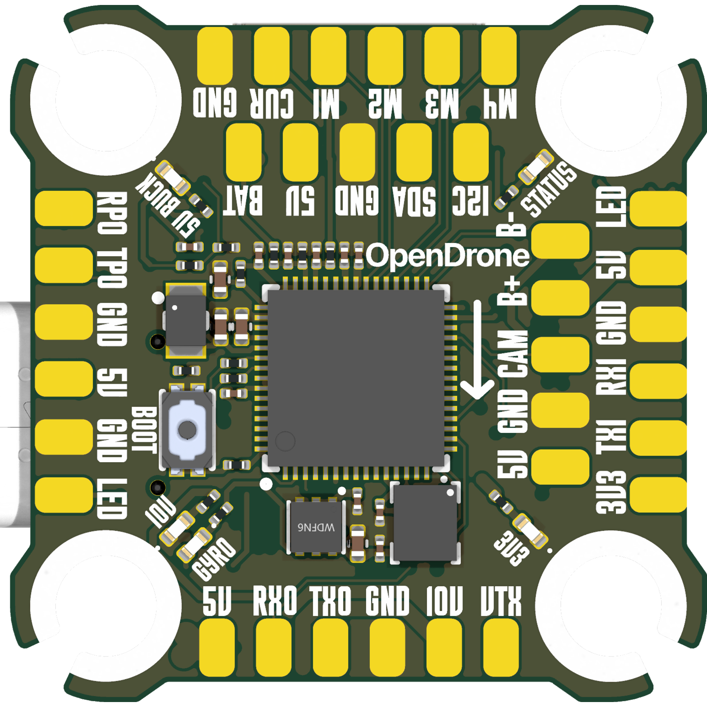
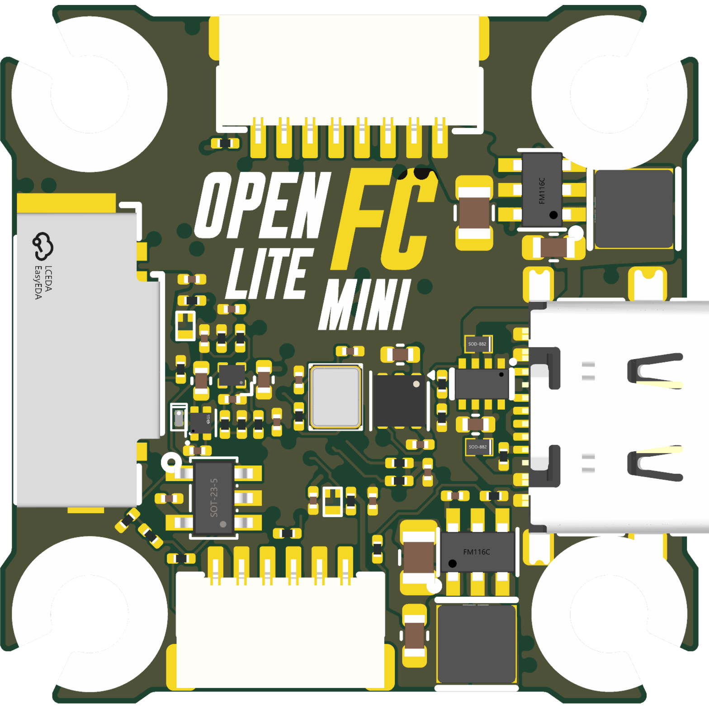

# OpenFC-Lite-Mini

Open-source Betaflight flight controller with a 20 x 20 mm mounting pattern, part of the incutec OpenDrone line. Designed in KiCad 10 for JLCPCB assembly. Its sibling [OpenFC-Lite](https://github.com/incutec-hw/OpenFC-Lite) (30.5 x 30.5 mm, RP2354B: bigger pads, more I/O, OSD debug pads) shares this design. Specifications are below; full design detail is in [hardware/docs/DESIGN.md](hardware/docs/DESIGN.md).

<p>


</p>

## Status

**Hardware validated**, Rev2, 2026-08-05.
Latest production export set is `OpenFC-Lite-Mini-rev2` (2026-06-04), generated with the KiCad Fabrication Toolkit for JLCPCB assembly.

## Certification

<a href="https://certification.oshwa.org/be000027.html">
  <picture>
    <source media="(prefers-color-scheme: dark)" srcset="images/oshwa-certified-dark.svg" />
    
  </picture>
</a>

OpenFC-Lite-Mini is **certified open source hardware** by the [Open Source Hardware Association](https://www.oshwa.org/), OSHWA UID **[BE000027](https://certification.oshwa.org/be000027.html)**.

Build video: [How Flight Controllers Work (so I built my own)](https://www.youtube.com/watch?v=XDYZoMRJFeQ)

## Links

- Product page: [opendrone.be/products/openfc-lite](https://opendrone.be/products/openfc-lite)
- Video channel: [JustFPV on YouTube](https://www.youtube.com/@justfpv1432)

## Specifications

| Parameter | Value |
|---|---|
| MCU | RP2354A, dual Cortex-M33 @ 150 MHz, 2 MB stacked flash, QFN-60, 30 GPIO |
| IMU | 6-axis on SPI1, LGA-14 footprint (ST and TDK compatible), BMI270 populated |
| Blackbox | microSD card slot (TF-021B-H265) on SPI0 |
| OSD | Analog, PIO-driven: sync separator + video op-amp + SPDT switch |
| RX | External, over UART |
| Power | 3S-6S input, switchable 10V VTX rail + always-on 5V, reverse-polarity protected |
| USB | USB-C, USB-CDC for configuration |
| Firmware | Betaflight, custom target `OPENFC_LITE_MINI_RP2350A` |
| PCB | 6-layer, 20 x 20 mm mounting pattern |

Part-level detail (power tree, GPIO map, OSD front end, PIO allocation, firmware target) is in [hardware/docs/DESIGN.md](hardware/docs/DESIGN.md).

## Repository layout

| Path | Contents |
|---|---|
| `hardware/` | KiCad 10 project: schematics, PCB, project-local libraries |
| `hardware/docs/` | Design documentation ([DESIGN.md](hardware/docs/DESIGN.md)) |
| `hardware/research/` | IMU selection, open items |
| `hardware/tools/` | Analysis scripts (Python, kicad-skip / pcbnew API) |
| `hardware/production/` | Fabrication exports per revision (generated, gitignored) |
| `libs/KiCad-Library` | Shared Incutec symbol/footprint/3D library (git submodule) |
| `images/` | Board renders and certification marks |

## Design entry points

- Top schematic: `hardware/OpenFC.kicad_sch` (hierarchical)
- Sub-sheets: `rp2350a.kicad_sch` (MCU, crystal, USB-C), `power.kicad_sch`, `imu.kicad_sch`, `osd.kicad_sch`, `blackbox.kicad_sch`, `pads.kicad_sch`
- Board layout: `hardware/OpenFC.kicad_pcb`, 6 copper layers

The project-local libraries are `hardware/lib.kicad_sym`, `hardware/lib.pretty/`, and `hardware/lib.3dshapes/`; the project lib tables also reference the shared `Incutec` library from the `libs/KiCad-Library` submodule, used for new parts.

## Build and export

```
git clone --recursive https://github.com/incutec-hw/OpenFC-Lite-Mini.git
```

Open `hardware/OpenFC.kicad_pro` in KiCad 10. Production exports (gerbers, BOM, CPL) are generated with the [KiCad Fabrication Toolkit](https://github.com/bennymeg/Fabrication-Toolkit) plugin. Headless checks and exports use `kicad-cli`:

```
kicad-cli sch erc --exit-code-violations hardware/OpenFC.kicad_sch
kicad-cli pcb drc --exit-code-violations hardware/OpenFC.kicad_pcb
kicad-cli pcb export gerbers -o out/ hardware/OpenFC.kicad_pcb
```

## Manufacturing

Fabricated and assembled at JLCPCB: 6-layer board, LCSC parts. Per-revision BOM, CPL, and gerber sets are generated into `hardware/production/` (gitignored) with the Fabrication Toolkit, using the tracked `hardware/fabrication-toolkit-options.json`.

## Contributing

See [CONTRIBUTING.md](CONTRIBUTING.md).

## License

Hardware licensed under [CERN-OHL-S-2.0](https://ohwr.org/cern_ohl_s_v2.txt). See [LICENSE](LICENSE).
